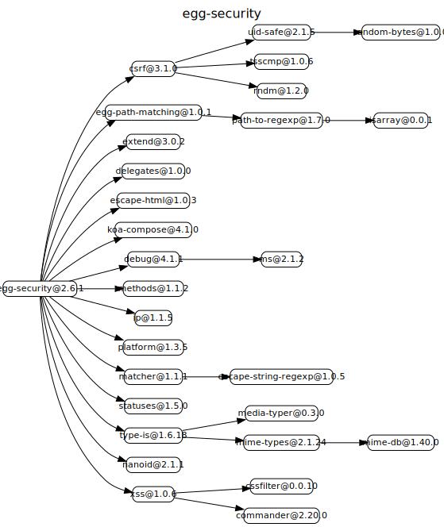

# egg-security

Security plugin in egg
Egg's default security plugin, generally no need to configure.

# 源码分析

提供一系列转义的helper方法，和一系列安全的中间件，加上各自响应头。

## 文件结构

``` bash
├── agent.js
├── app
|  ├── extend
|  |  ├── agent.js - 提供safeCurl方法，基于lib/extend/safe_curl.js
|  |  ├── application.js - 给app上提供几个方法injectCsrf，injectNonce，injectHijackingDefense和safeCurl，基于lib/extend/safe_curl.js
|  |  ├── context.js - 挂载csrf属性和assertCsrf方法来获取和校验token。基于csrf模块。
|  |  └── helper.js - 将lib下的helper批量暴露
|  └── middleware
|     └── securities.js - 将lib下middleware进行合并组装，利用koa-compose
├── app.js - 首先检查csrf参数合法性，调用lib/safe_redirect.js。
├── config
|  ├── config.default.js - 默认参数，全部开启。配置有个csrf，xframe，hsts等等
|  └── config.local.js
├── index.js - 对外暴露各个中间件和util
├── lib
|  ├── extend
|  |  └── safe_curl.js - 封装safeCurl方法，对config.ssrf处理后带上参数调用curl。
|  ├── helper
|  |  ├── cliFilter.js - 提供cliFilter方法，过滤掉非正常字符
|  |  ├── escape.js - 直接暴露escape-html模块
|  |  ├── index.js - 将helper下所有内容暴露出去
|  |  ├── shtml.js - 提供shtml方法，判断href和src内容是否在白名单。最后基于xss模块过滤。
|  |  ├── sjs.js - 提供sjs方法，对js内容进行转义，防xss。
|  |  ├── sjson.js - 提供sjson方法，对json内容进行转义，所有key为字符串则走sjs方法。
|  |  ├── spath.js - 提供spath方法，针对路径
|  |  └── surl.js - 提供surl方法，解析url，判断白名单。
|  ├── middlewares
|  |  ├── csp.js - 根据配置设置响应头content-security-policy，兼容ie
|  |  ├── csrf.js - 对csrf的token在请求阶段进行校验，基于app/extend/context.js挂载在ctx上的和csrf有关的方法
|  |  ├── dta.js - 请求阶段判断ctx.path是否是安全的路径，不带../等。
|  |  ├── hsts.js - 响应阶段，设置Strict-Transport-Security头。告诉浏览器只能通过HTTPS访问当前资源，而不是HTTP
|  |  ├── methodnoallow.js - 请求时拦截不允许的http method类型
|  |  ├── noopen.js - 设置响应头x-download-options，用于指定IE 8以上版本的用户不打开文件而直接保存文件。在下载对话框中不显示“打开”选项。
|  |  ├── nosniff.js - 设置响应体x-content-type-options，用于提示客户端一定要遵循在 Content-Type 首部中对  MIME 类型 的设定。
|  |  ├── referrerPolicy.js - 设置响应头referrer-policy
|  |  ├── xframe.js - 设置响应头x-frame-options
|  |  └── xssProtection.js - 设置响应头x-xss-protection，当检测到跨站脚本攻击 (XSS)时，浏览器将停止加载页面。
|  ├── safe_redirect.js - 将原有的redirect挂载到unsafeRedirect，基于配置白名单提供新的redirect方法。
|  └── utils.js
```

## 外部模块依赖



## 逐个文件分析

### index.js

对外暴露各个中间件和util

### app.js

首先检查csrf参数合法性。

调用lib/safe_redirect.js。

### agent.js

简单format下配置

### lib/safe_redirect.js

将原有的app.response.redirect挂载到app.response.unsafeRedirect上。

封装新的redirect方法，对配置中的白名单进行过滤和校验。


### app/middleware/securities.js

将lib下middleware进行合并组装，利用koa-compose

### app/extend/context.js

挂载一些属性和方法到ctx。

csrf属性，基于csrf模块创建token并返回。

assertCsrf方法，用来判断csrf是否合法。


## Install

```bash
$ npm i egg-security
```

## Usage & configuration

- `config.default.js`

```js
exports.security = {
  xframe: {
    value: 'SAMEORIGIN',
  },
};
```

### Disable security precautions

If you want to disable some security precautions, set `enable` porperty to 'false' directly.

For example, disable xframe defense:

```js
exports.security = {
  xframe: {
    enable: false,
  },
};
```

### match & ignore

If you want to set security config open for a certain path, you can configure `match` option.

For example, just open csp when path contains `/example`, you can configure with the following configuration:

```js
exports.security = {
  csp: {
    match: '/example',
    policy: {
      //...
    },
  },
};

```

If you want to set security config disable for a certain path, you can configure `match` option.

For example, just disable xframe when path contains `/example` while our pages can be embedded in cooperative businesses , you can configure with the following configuration:

```js
exports.security = {
  csp: {
    ignore: '/example',
    xframe: {
      //...
    },
  },
};

```

__mention：`match` has higher priority than `ignore`__

### Dynamic configuration for security plugins depend on context

There are times when we want to be more flexible to configure security plugins.For example:

1. To decide whether to enable or disable the xframe security header from the context of the request.
2. To decide csp policies from different request urls.

Then we can configure `ctx.securityOptions[name] opts` in the custom middleware or controller,then the current request configuration will overrides the default configuration (new configuration will be merged and override the default project configuration, but only take effect in the current request)

```js
async ctx => {
  // if satisfied some condition
  // change configuration
  ctx.securityOptions.xframe = {
    value: 'ALLOW-FROM: https://domain.com',
  };
  // disable configuration
  ctx.securityOptions.xssProtection = {
    enable: false,
  }
}
```

Not all security plugins support dynamic configuration, only following plugins list support

- csp
- hsts
- noopen
- nosniff
- xframe
- xssProtection

And in ` helper `：

- shtml

helper is the same way to configure.

```js
ctx.securityOptions.shtml = {
  whiteList: {
  },
};
```

#### Mention

- Security is a big thing, please pay attention to the risk of changes in the security configuration (especially dynamic changes)
- `ctx.securityOptions` the current request configuration will overrides the default configuration, but it does not make a deep copy，so pay attention to configure `csp.policy`, it will not be merged.
- If you configure `ctx.securityOptions`，please write unit tests to ensure the code is correct.


## API

### ctx.isSafeDomain(domain)

Whether or not the domain is in the whitelist of the configuration. See `ctx.redirect`.

Note: [egg-cors](https://github.com/eggjs/egg-cors) module uses this function internally to determine whether or not send back an `Access-Control-Allow-Origin` response header with the value of safe domain. Otherwise, ignore the request with an error, `No 'Access-Control-Allow-Origin' header is present on the requested resource.`

```js
exports.security = {
  domainWhiteList: ['http://localhost:4200']
};
```

## Interface restriction

### CSRF

__usage__

* `ctx.csrf` getter for CSRF token

Generally used when send POST form request. When page rendering, put `ctx.csrf` into form hidden field or query string.(`_csrf` is the key).
When submitting the form, please submit with the `_csrf` token parameter.

#### Using CSRF when upload by formData

browser:

```html
<form method="POST" action="/upload?_csrf={{ ctx.csrf | safe }}" enctype="multipart/form-data">
  title: <input name="title" />
  file: <input name="file" type="file" />
  <button type="submit">上传</button>
</form>
```

#### Using CSRF when request by AJAX

CSRF token will also set to cookie by default, and you can send token through header:

In jQuery:

```js
var csrftoken = Cookies.get('csrftoken');

function csrfSafeMethod(method) {
  // these HTTP methods do not require CSRF protection
  return (/^(GET|HEAD|OPTIONS|TRACE)$/.test(method));
}
$.ajaxSetup({
  beforeSend: function(xhr, settings) {
    if (!csrfSafeMethod(settings.type) && !this.crossDomain) {
      xhr.setRequestHeader('x-csrf-token', csrftoken);
    }
  },
});
```

#### Options

there are some options that you can customize:

```js
exports.security = {
  csrf: {
    type: 'ctoken',             // can be ctoken or referer or all, default to ctoken
    useSession: false,          // if useSession set to true, the secret will keep in session instead of cookie
    ignoreJSON: false,          // skip check JSON requests if ignoreJSON set to true
    cookieName: 'csrfToken',    // csrf token's cookie name
    sessionName: 'csrfToken',   // csrf token's session name
    headerName: 'x-csrf-token', // request csrf token's name in header
    bodyName: '_csrf',          // request csrf token's name in body
    queryName: '_csrf',         // request csrf token's name in query
    refererWhiteList: [],       // referer white list
  },
}
```

#### Rotate CSRF secret

Must call `ctx.rotateCsrfSecret()` when user login to ensure each user has independent secret.

### safe redirect

* `ctx.redirect(url)` If url is not in the configuration of the white list, the redirect will be prohibited

* `ctx.unsafeRedirect(url)` Not Recommended;

Security plugin override `ctx.redirect` method，all redirects will be judged by the domain name.

If you need to use `ctx.redirect`, you need to do the following configuration in the application configuration file：

```js
exports.security = {
  domainWhiteList:['.domain.com'],  // security whitelist, starts with '.'
};
```

If user do not configure `domainWhiteList` or `domainWhiteList` is empty, it will pass all redirects, equal to `ctx.unsafeRedirect(url)`. `domainWhiteList` and `url` are case insensitive.

### jsonp

Based on [jsonp-body](https://github.com/node-modules/jsonp-body).

Defense:

* The longest callback function name limit of 50 characters.
* Callback function only allows "[","]","a-zA-Z0123456789_", "$" "." to prevent `xss` or `utf-7` attack.

Config：

* callback function default name `_callback`.
* limit - function name limit, default by 50.

## helper

### .escape()

String xss filter, the most secure filtering mechanism.

```js
const str = '><script>alert("abc") </script><';
console.log(ctx.helper.escape(str));
// => &gt;&lt;script&gt;alert(&quot;abc&quot;) &lt;/script&gt;&lt;
```

In nunjucks template, escape by default.

### .surl()

url filter.

Used for url in html tags (like `<a href=""/>`),please do not call under other places.

  `helper.surl($value)`。

** Mention: Particular attention, if you need to resolve URL use `surl`，`surl` need warpped in quotes, Otherwise will lead to XSS vulnerability.**

Example: do not use surl

```html
<a href="$value" />
```

output:

```html
<a href="http://ww.domain.com<script>" />
```

Use surl

```html
<a href="helper.surl($value)" />
```

output:

```html
<a href="http://ww.domain.com&lt;script&gt;" />
```

#### protocolWhitelist

If url's protocol is not in the protocol whitelist, it will return empty string.

Protocol whitelist is `http`, `https`, `file`, `data`.

So if you want `surl` support custom protocol, please extend the security `protocolWhitelist` config :

```js
exports.security = {
  protocolWhitelist: ['test']
};
```

### .sjs()

Used to output variables in javascript(include onload/event),it will do `JAVASCRIPT ENCODE` for the variable string.It will escape all characters to `\x` which are not in the whitelist to avoid XSS attack.

```js
const foo = '"hello"';

// not use sjs
console.log(`var foo = "${foo}";`);
// => var foo = ""hello"";

// use sjs
console.log(`var foo = "${ctx.helper.sjs(foo)}";`);
// => var foo = "\\x22hello\\x22";
```

### .shtml()

If you want to output richtexts in views, you need to use `shtml` helper.
It will do XSS filter, then output html tags to avoid illegal scripts.

** shtml is a very complex process, it will effect server performance, so if you do not need to output HTML, please do not use shtml.**

Examples:

```js
// js
const value = `<a href="http://www.domain.com">google</a><script>evilcode…</script>`;

// in your view
<html>
<body>
  ${helper.shtml($value)}
</body>
</html>
// => <a href="http://www.domain.com">google</a>&lt;script&gt;evilcode…&lt;/script&gt;
```

shtml based on [xss](https://github.com/leizongmin/js-xss/), and add filter by domain feature.

- [default rule](https://github.com/leizongmin/js-xss/blob/master/lib/default.js)
- custom rule http://jsxss.com/zh/options.html

For example, only support `a` tag, and filter all attributes except for `title`:

```javascript
whiteList: {a: ['title']}
```

options:

> `config.helper.shtml.domainWhiteList` has been deprecated, please use `config.security.domainWhiteList` instead.

Mention that `shtml` uses a strict white list mechanism, in addition to filtering out the XSS risk of the string,`tags` and `attrs` which are not in the [default rule](https://github.com/leizongmin/js-xss/blob/master/lib/default.js) will be filtered.

For example `html` tag is not in the whitelist.

```js
const html = '<html></html>';

// html
${helper.shtml($html)}

// output none
```

Commonly used `data-xx` property is not in the whitelist, so it will be filtered.
So please check the applicable scenarios for `shtml`, it usually used for richtext submmited by user.

A usage error will limit functions, also affect the performance of the server.
Such scenes are generally forums, comments, etc.

Even if the forum does not support the HTML content input, do not use this helper, you can directly use `escape` instead.

### .spath()

If you want to use users input for a file path, please use spath for security check. If path is illegal, it will return null.

Illegal path:

- relative path starts with `..`
- absolute path starts with `/`
- above path try to use `url encode` to bypass the check

```js
const foo = '/usr/local/bin';
console.log(ctx.helper.spath(foo2));
// => null
```

### .sjson()

json encode.

If you want to output json in javascript without encoding, it will be a risk for XSS.
sjson supports json encode，it will iterate all keys in json, then escape all characters in the value to `\x` to avoid XSS attack, and keep the json structure unchanged.
If you want to output json string in your views, please use `${ctx.helper.sjson(var)}`to escape.

**it has a very complex process and will lost performance, so avoid the use as far as possible**

example:

```js
  <script>
    window.locals = ${ctx.helper.sjson(locals)};
  </script>
```

### .cliFilter()

It will cause remote command execution vulnerability, when user submit the implementation of the command by browser.because the server does not filter for the implementation of the function, resulting in the execution of the command can usually lead to the invasion of the server.

If you want to get user submit for command's parameter, please use `cliFilter`。

before fix:

```js

  cp.exec("bash /home/admin/ali-knowledge-graph-backend/initrun.sh " + port);

```

after fix:

```js

  cp.exec("bash /home/admin/ali-knowledge-graph-backend/initrun.sh " + ctx.helper.cliFilter(port));

```

## Security Headers

Refer to [lusca](https://github.com/krakenjs/lusca), appriciate for their works.

### hsts Strict-Transport-Security

Disabled by default. If your website based on https, we recommend you should enable it.

- maxAge one year by default `365 * 24 * 3600`
- includeSubdomains false by default


### csp

Default disabled. If you need to enable, please contact your security engineers and determine the opening strategy

- policy policies used by csp

### X-Download-Options:noopen

Default enabled, disable IE download dialog automatically open download file and will cause XSS

### X-Content-Type-Options:nosniff

Disable IE8's auto MIME sniffing. E.g: take `text/plain` as `text/html` by mistake and render it, especially when there's something untrusted in the local service.

### X-Frame-Options

Defaulting to "SAMEORIGIN", only allow iframe embed by same origin.

- value Defaulting to `SAMEORIGIN`

### X-XSS-Protection

- disable Defaulting to `false`，same as `1; mode=block`.

### SSRF Protection

In a [Server-Side Request Forgery (SSRF)](https://www.owasp.org/index.php/Server_Side_Request_Forgery) attack, the attacker can abuse functionality on the server to read or update internal resources.

`egg-security` provide `ctx.safeCurl`, `app.safeCurl` and `agent.safeCurl` to provide http request(like `ctx.curl`, `app.curl` and `agent.curl`) with SSRF protection.

#### Configuration

* ipBlackList(Array) - specific which ip are illegal when request with `safeCurl`.
* checkAddress(Function) - determine the ip by the function's return value, `false` means illegal ip.

```js
// config/config.default.js
exports.security = {
  ssrf: {
    // support both cidr subnet or specific ip
    ipBlackList: [
      '10.0.0.0/8',
      '127.0.0.1',
      '0.0.0.0/32',
    ],
    // checkAddress has higher priority than ipBlackList
    checkAddress(ip) {
      return ip !== '127.0.0.1';
    }
  },
};
```

## Other

* Forbid `trace` `track` http methods.

<!-- GITCONTRIBUTOR_START -->

## Contributors

|[<br/><sub><b>dead-horse</b></sub>](https://github.com/dead-horse)<br/>|[<br/><sub><b>fengmk2</b></sub>](https://github.com/fengmk2)<br/>|[<br/><sub><b>Maledong</b></sub>](https://github.com/Maledong)<br/>|[<br/><sub><b>jtyjty99999</b></sub>](https://github.com/jtyjty99999)<br/>|[<br/><sub><b>popomore</b></sub>](https://github.com/popomore)<br/>|[<br/><sub><b>shaoshuai0102</b></sub>](https://github.com/shaoshuai0102)<br/>|
| :---: | :---: | :---: | :---: | :---: | :---: |
[<br/><sub><b>ai</b></sub>](https://github.com/ai)<br/>|[<br/><sub><b>guoshencheng</b></sub>](https://github.com/guoshencheng)<br/>|[<br/><sub><b>atian25</b></sub>](https://github.com/atian25)<br/>|[<br/><sub><b>EliYao</b></sub>](https://github.com/EliYao)<br/>

This project follows the git-contributor [spec](https://github.com/xudafeng/git-contributor), auto updated at `Fri Mar 08 2019 10:02:52 GMT+0800`.

<!-- GITCONTRIBUTOR_END -->

## License

[MIT](https://github.com/eggjs/egg-security/blob/master/LICENSE)
